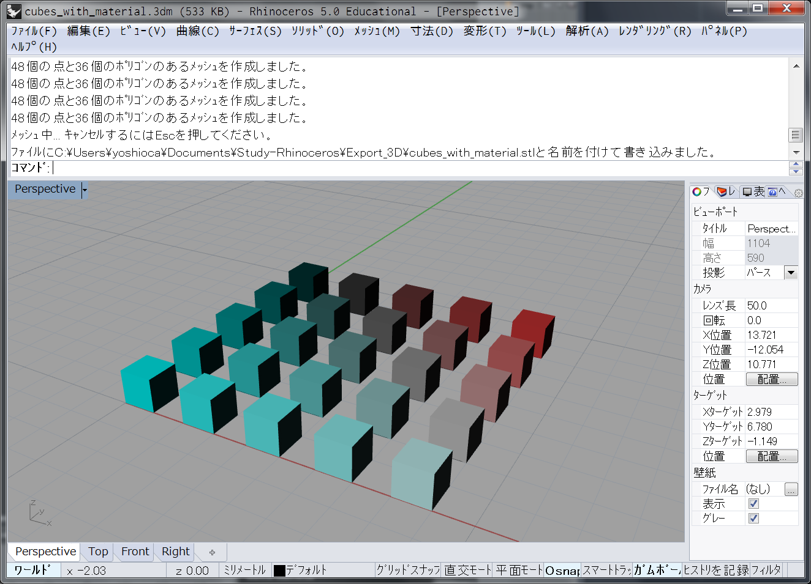
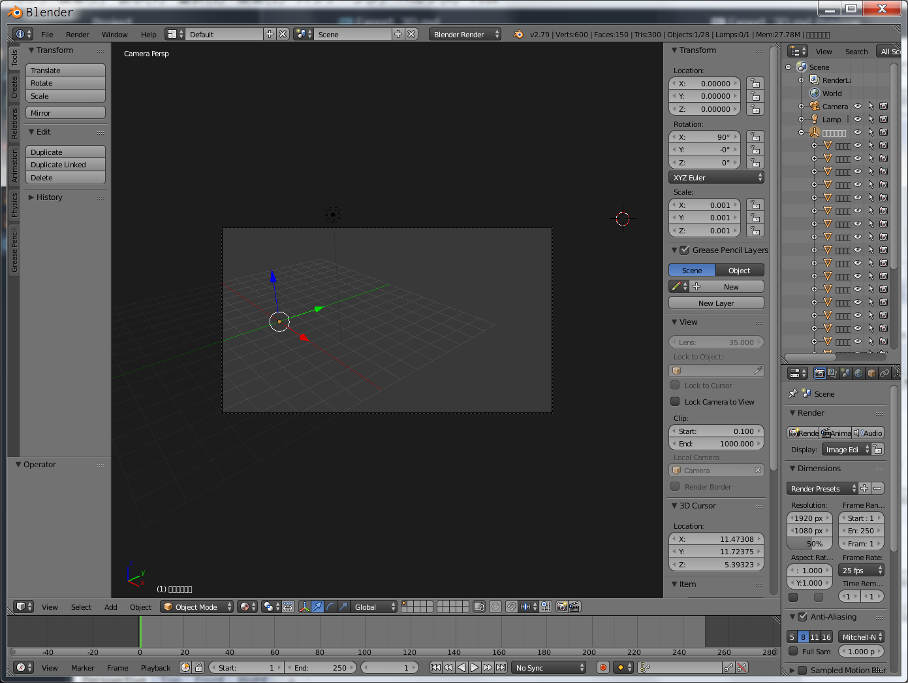
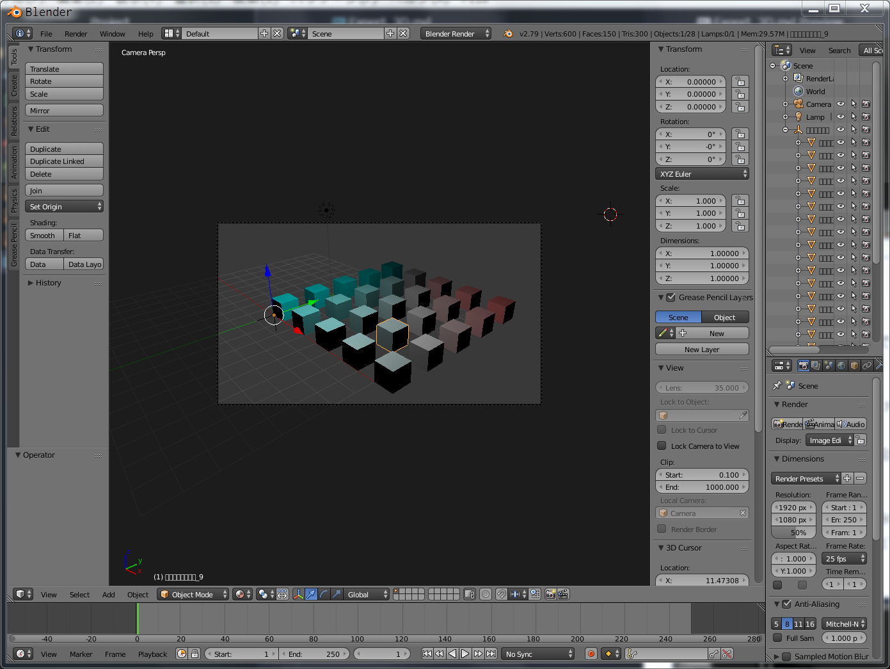
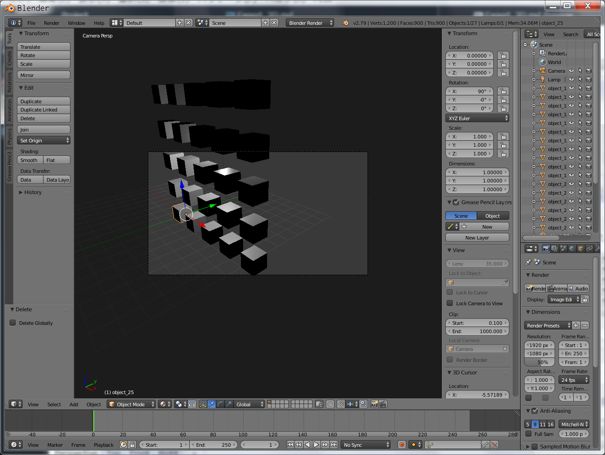

# Export_3D  

ファイル IO  

Rhino は、右手系の Z-up  
Blender も同様  

  

### Format  

- ベクタ 系  
  - IGES  
  - STEP  

- メッシュ系  
  - DAE // material  
  - FBX // material  
  - OBJ  
  - STL    

- よくわからない  
  - ABC // alembic file  

---  

---  

### DAE  

色、書き出せる。  

複数オブジェクトを、1つのファイルで書き出しても、問題ない。  
それぞれのオブジェクトに名前が振られている。  

Blender で、すべてのオブジェクトの選択が出来ないので不便（FBX では出来る）  

---  

### FBX  

色、書き出せる。  
書き出し時に、Lambert と、Phong のどちらかを選ぶ。差はよくわからない。  

複数オブジェクトを、1つのファイルで書き出しても、問題ない。  
それぞれのオブジェクトに名前が振られている。  

  

  

---  

### OBJ  

色、不可？、Rhino の Export では、不可っぽい。  

複数オブジェクトを、1つのファイルで書き出しても、問題ない。  
それぞれのオブジェクトに名前が振られている。  

Blender では、FBX 読み込み時の設定で、角度とスケールがプリセットされているが、0度 / 1倍 にすれば、ok。  

  

---  

### STL  

色、不可。  

複数オブジェクトを、1つのファイルで書き出すと、位置関係の変更不可。  

3D プリント以外の用途はおそらく無し。  

---  

---  

###  Export 3D Model with Material  

FBX が良さそう。  

---  